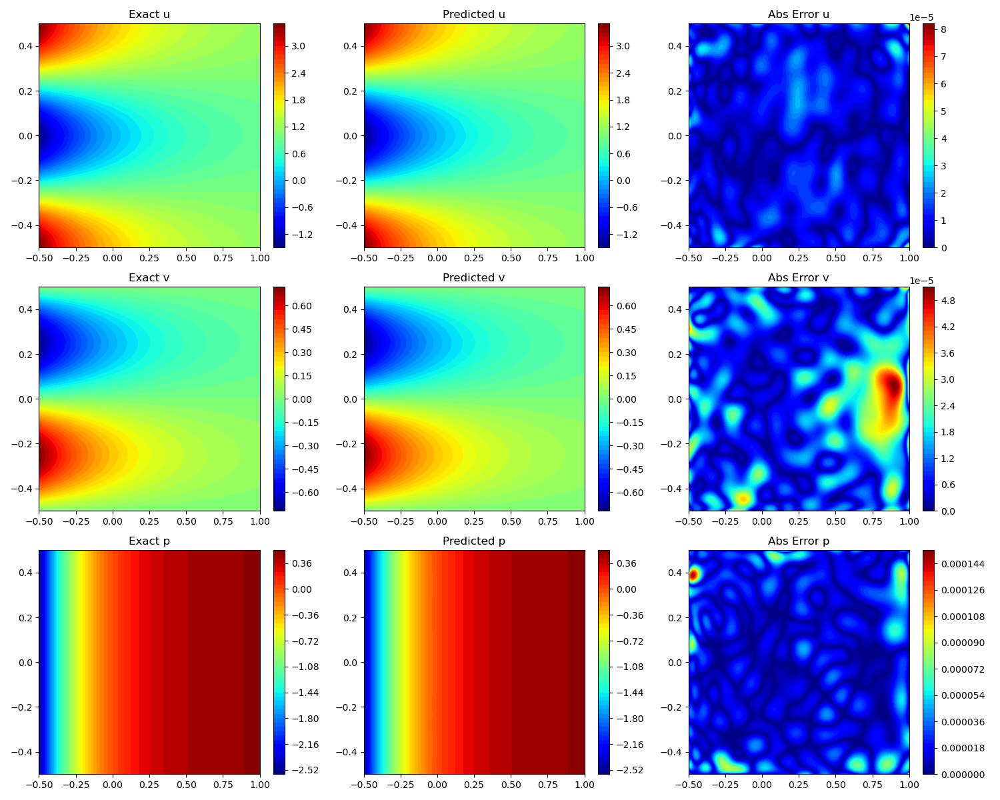
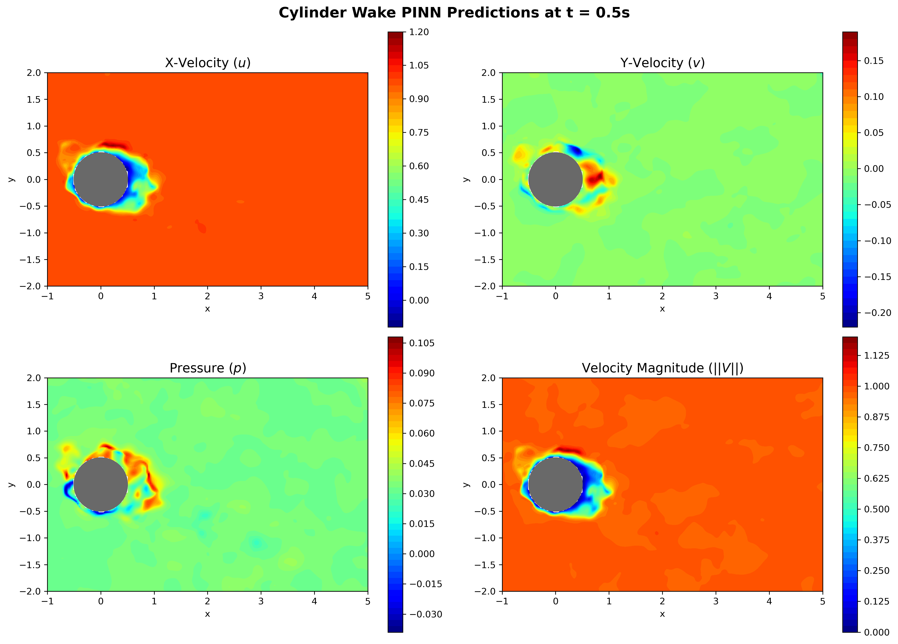

# PINN Navier-Stokes Solver (Kovasznay + Cylinder Flow)

This repository contains Physics-Informed Neural Networks (PINNs) for two incompressible Navier-Stokes benchmarks:

- Steady 2D Kovasznay flow
- Unsteady 2D cylinder wake flow

The models learn velocity and pressure fields by minimizing boundary supervision loss and PDE residual loss.

## Training Results

### Kovasznay Flow (Re = 20)

Best run metrics captured from logged training summaries:

- Boundary MSE: `1.20e-09`
- Physics MSE: `2.24e-07`
- Final weighted objective: `-15.63`
- RAR + L-BFGS run: Boundary MSE `1.14e-09`, Physics MSE `2.81e-07`

Interpretation:

- The PINN converges to very low boundary and physics residual errors.
- Adaptive weighting and second-stage optimization (L-BFGS) are critical to reach the final regime.
- Residual-based adaptive refinement (RAR) stabilizes physics loss as collocation density increases in hard regions.

### Cylinder Flow (Re = 100)

Representative logged run metrics:

- Boundary MSE: `3.67e-06`
- Physics MSE: `1.45e-05`
- Final weighted objective: `-9.53`

Interpretation:

- The unsteady wake problem is more challenging than Kovasznay; residuals remain higher, which is expected.
- The pipeline supports additional RAR passes to improve wake-region fidelity.

## Result Figures

### Kovasznay Field Predictions



### Cylinder Flow Progression



## Governing Equations

For velocity $(u, v)$ and pressure $p$, the incompressible Navier-Stokes equations are:

$$
\nabla \cdot \mathbf{u} = 0
$$

$$
\mathbf{u} \cdot \nabla \mathbf{u} + \nabla p - \frac{1}{Re} \nabla^2 \mathbf{u} = 0
$$

Cylinder flow extends this with the transient term $\partial \mathbf{u}/\partial t$.

## Project Structure

```
PDE-Solver/
├── README.md
├── requirements.txt
├── pinn_kovasznay.pth
├── pinn_cylinder.pth
├── kovasznay_flow/
│   ├── dataset.py
│   ├── evaluate.py
│   ├── kovasznay.py
│   ├── loss.py
│   ├── network.py
│   ├── refine.py
│   ├── train.py
│   └── results/
└── cylinder_flow/
    ├── dataset.py
    ├── evaluate.py
    ├── loss.py
    ├── network.py
    ├── refine.py
    ├── train.py
    └── results/
```

## Installation

```bash
pip install -r requirements.txt
```

## Usage

Run all commands from the repository root.

### Kovasznay

```bash
python kovasznay_flow/train.py
python kovasznay_flow/refine.py
python kovasznay_flow/evaluate.py
```

### Cylinder

```bash
python cylinder_flow/train.py
python cylinder_flow/refine.py
python cylinder_flow/evaluate.py
```

## Notes

- Scripts automatically use GPU if CUDA is available; otherwise they run on CPU.
- Existing plots in `*/results/` reflect prior training runs and can be overwritten by new experiments.
- Weights & Biases logging is enabled in training/refinement scripts.

## License

This project is distributed under the terms in `LICENSE`.
